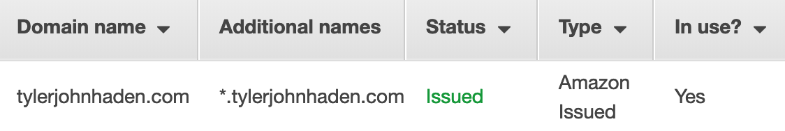
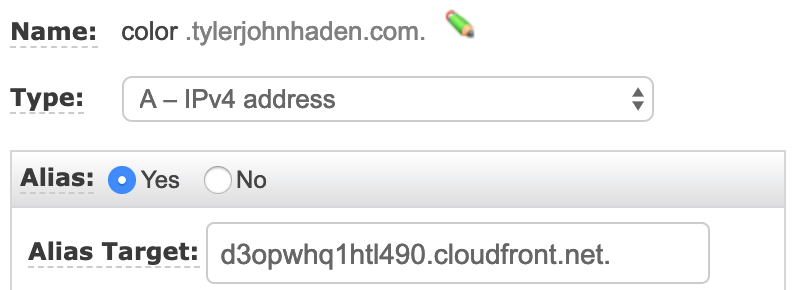
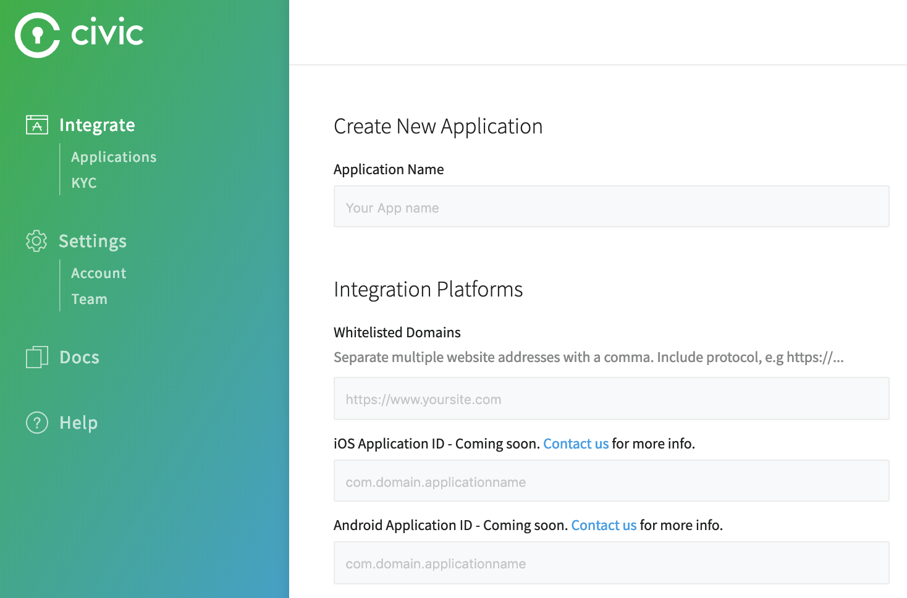
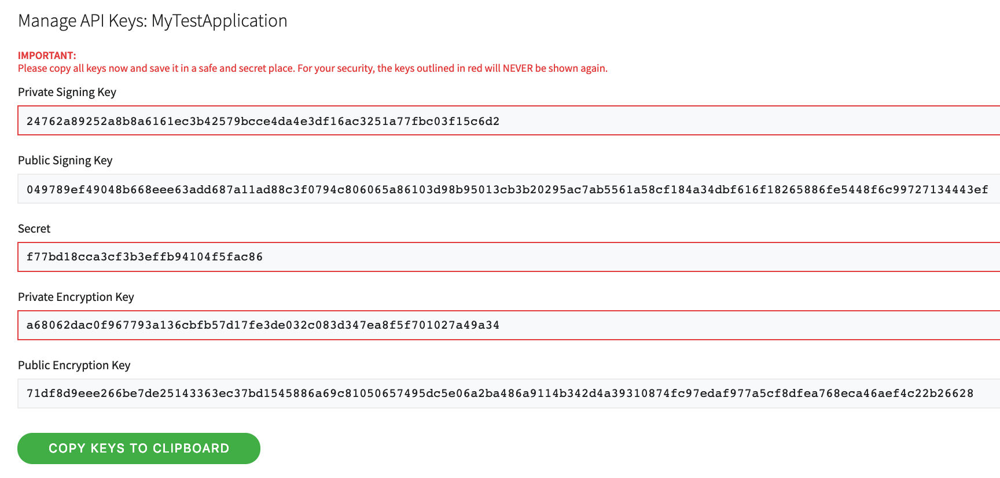

---
authors:
- Tyler John Haden
tags:
- serverless
- security (todo: are these good tags?)
- authentication
date: 
title: Adding Civic Integration to Your Boilerplate AWS Static Website
image: todo: add pic
---

This article describes an application that takes advantage of AWS serverless services to provide a static website and access controlled resources. To satisfy the static website hosting, we will use Route53, ACM, CloudFront, and S3. Https should be the standard so we will skip "S3 only" hosting.

Our application will also have some super secret resources that will require our user to supply some form of identity. [Civic](todo: add link) is a third party service that blah blah blah todo: add more. We can use Civic's client side javascript SDK to generate a QR code on our site easily enough. However we will need to run some server side code as well. 

Lambda is a great option to run Civic's server side javascript SDK, and will also satisfy our _serverless_ fascination. We can employee the [Serverless framework](todo: add link) to spin up an API Gateway, and Lambda function for us. It'll also include a tool for specifying the same SSL certificate we used to secure our static site for our API.


# Create static website with custom domain and SSL on AWS

There are many ways to accomplish this, and many online resources to help you in this process. We will give an overview of this process, but for more detailed instructions, follow AWS's [instructions for CloudFront static websites](https://aws.amazon.com/premiumsupport/knowledge-center/cloudfront-serve-static-website/).

## Register a domain and set route53 as it's DNS
   
If you did not get the domain through AWS, check out their [instructions for migrating dns to route53](https://docs.aws.amazon.com/Route53/latest/DeveloperGuide/migrate-dns-domain-inactive.html). It essentially involves setting the name servers for your domain to AWS's name servers. That way, we can use route53 to quickly set up CNAME (alias) records under that domain.

## Request a certificate for your domain
   
Here are AWS's [instructions for requesting a public certificate](https://docs.aws.amazon.com/acm/latest/userguide/gs-acm-request-public.html). It's important that you add an additional sub-domain to the certificate, i.e. `api.yourdomain.com` or `*.yourdomain.com`. This is necessary because we will be using one domain for our CloudFront, and another for our API Gateway. Now we can use the same certificate for both resources.

   Mine looks like this... 
   For this project, I'm using [https://civic.tylerjohnhaden.com](https://civic.tylerjohnhaden.com) for the website and [https://api.civic.tylerjohnhaden.com](https://api.civic.tylerjohnhaden.com) for the API endpoint.

## Create an S3 bucket and upload initial static files

Since CloudFront takes the longest to spin up, let us speed up the process by skipping any integration yet. To do this, we need at least our `index.html` in a public s3 bucket. Here is an [intro to getting started with S3](https://docs.aws.amazon.com/quickstarts/latest/s3backup/welcome.html). You just need to ensure that the bucket is public. We won't need to configure static website hosting because CloudFront will take care of that (the S3 built-in hosting does not support SSL).

```html
<!DOCTYPE html>
<html lang="en">
<head>
    <meta charset="UTF-8">
    <title>Welcome!</title>
</head>
<body>
    <h1>Welcome!</h1>
    <button onclick="verifyIdentity(this)">Verify Identity</button>
</body>
</html>
```

## Create a CloudFront distribution with your domain

Using the S3 bucket as an origin, spin up a new distribution. You will need to use the certificate previously created and add the domain you want the site to use as a CNAME in CloudFront.
   
To get that domain to route to your distribution, you will need to add an alias to Route53. The easiest way to do this is to copy the domain name of the CloudFront distribution (not the CNAME), and setting it as the Alias Target in Route53. It should look something like this:



p.s. You don't need to add a sub-domain.

Once created, it will take a while to spin up, so let us continue with the rest of the stack. Uploading a new `index.html` takes a few seconds, so we can easily update our client side code later.


# Setup your Civic integration

See [Civic's documentation](https://docs.civic.com) for integrating their SDKs.

## Sign up for an account and create an application



## Generate app secrets and save them to AWS Parameter Store

Once you have your app configured, you will need to generate keys to use in Civic's SDKs. In Civic's integration portal for your app, click on the "Generate Keys Now" button. It will display several public and several private strings and will prompt you to save them before exiting. This is the last time you have the chance to save them! You can always revoke and regenerate new keys, or specify a time-to-live.



For this project, we will need the Private Signing Key, and the App Secret. We will also need the App ID, which will stay constant for our application and is not necessarily secret.

Since we will eventually need an AWS Lambda to use these parameters, let us save these into [Systems Manager - Parameter Store](https://console.aws.amazon.com/systems-manager/parameters) (and also so we don't lose them). Both the Private Signing Key and the App Secret should be encrypted at rest. Anyone with those values will be able to pretend to be us and access the user's data stored with Civic.

## Add Civic's client side SDK to our website

Civic has great documentation [todo: add link]() on how to integrate their code into your website. They currently offer javascript SDKs for client and server side functions, although their API is a typical REST https interface (todo: this sounds contrived).

```html
<head>
    ...
    <>
</head>
```


# Create a backend to verify identity

[discussion of jwt in a serverless environment](https://yos.io/2017/09/03/serverless-authentication-with-jwt/)

## Start a Serverless application

[todo: add description](https://www.npmjs.com/package/serverless)

[todo: add node + lambda info](https://docs.aws.amazon.com/lambda/latest/dg/nodejs-prog-model-handler.html)

## Write our Lambda authorizer

>A Lambda authorizer function's output must include the principal identifier (principalId) and a policy document (policyDocument) containing a list of policy statements. The output can also include a context map containing key-value pairs. If the API uses a usage plan (the apiKeySource is set to AUTHORIZER), the Lambda authorizer function must return one of the usage plan's API keys as the usageIdentifierKey property value.

## Write our Lambda function handler

## Specify our Civic app secrets using Parameter Store

[todo: add description](https://serverless.com/blog/serverless-secrets-api-keys/)

## Specify a custom domain and certificate


# Results, Rebuttles, and Improvements

ps [to tear down api](https://serverless.com/framework/docs/providers/aws/cli-reference/remove/)
