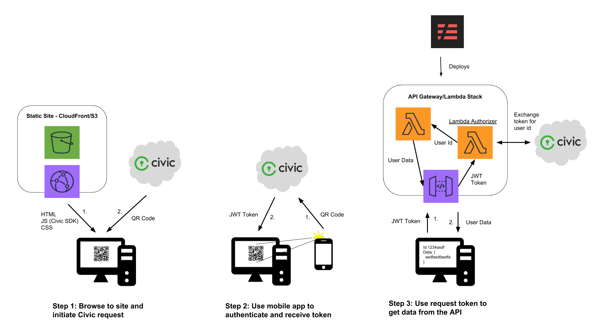
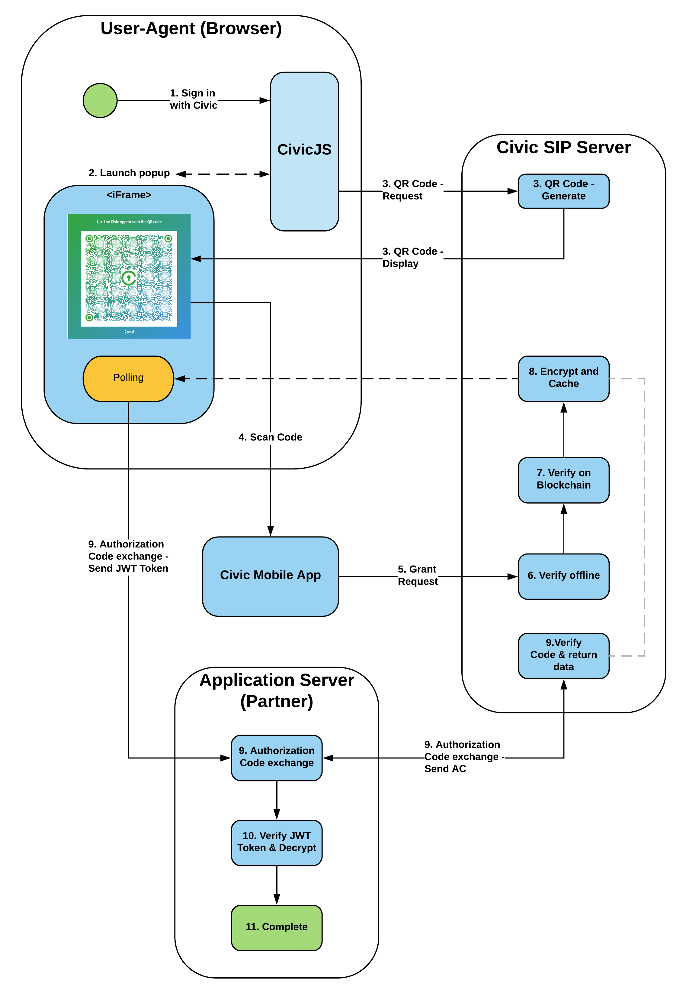
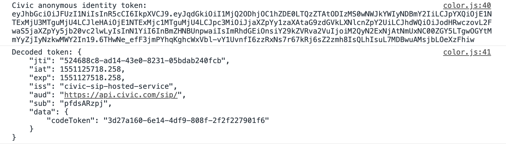

---
authors:
- Tyler John Haden
tags:
- aws
- serverless
- security
- blockchain
date: 
title: Integrating Civic into a Static Serverless Website
image: civic_jumbo.png
---


This article describes an application that takes advantage of AWS serverless services to provide a static website and anonymously access controlled resources. To satisfy the static website hosting, we will use Route53, ACM, CloudFront, and S3. Https should be the standard so we will skip "S3 only" hosting.

Our application will also have some super secret resources that will require our user to supply some form of identity. [Civic](https://www.civic.com/) is a third party secure identity ecosystem, that we can integrate for seamless anonymous (or non anonymous) user management. We can use this identity to uniquely control resource access, and customize the user's experience. Civic uses "Blockchain attestation-based access" instead of relying on username and password, allowing decentralized authorization.

Lambda is a great option to run Civic's server side Javascript SDK, and will also satisfy our _serverless_ fascination. We can employee the [Serverless framework](https://serverless.com/) to spin up an API Gateway, and Lambda function for us. It'll also include a tool for specifying the same SSL certificate we used to secure our static site for our API.


# User Flow and Outline



From the app's perspective, there are three general steps. 

1. When the user navigates to the static site, Civic's SDK will download either a QR code, or a code for linking to their mobile app if it is a mobile browser.
2. Once the user has scanned the QR code or used the deep link to open the Civic mobile app, Civic can return a signed JWT token unique to the app, user, and scope request. The token itself cannot be used to identity the user as it is essentially a signed UUID generated for every request.
3. The client now sends this token to the app's API which will be able to exchange the token for the user's data. If it is an anonymous scope request, only the user id will be returned. The API backend must now use the user id to craft the resources sent back to the client.


# Create static website with custom domain and SSL on AWS

There are many ways to accomplish this, and many online resources to help you in this process. We will give an overview of this process, but for more detailed instructions, follow AWS's [instructions for CloudFront static websites](https://aws.amazon.com/premiumsupport/knowledge-center/cloudfront-serve-static-website/).

## Register a domain and set route53 as it's DNS
   
If you did not get the domain through AWS, check out their [instructions for migrating DNS to Route53](https://docs.aws.amazon.com/Route53/latest/DeveloperGuide/migrate-dns-domain-inactive.html). It essentially involves setting the name servers for your domain to AWS's name servers. That way, we can use route53 to quickly set up CNAME and alias records under that domain.

## Request a certificate for your domain
   
Here are AWS's [instructions for requesting a public certificate](https://docs.aws.amazon.com/acm/latest/userguide/gs-acm-request-public.html). It's important that you add an additional sub-domain to the certificate, i.e. `api.yourdomain.com` or `*.yourdomain.com`. This is necessary because we will be using one domain for our static CloudFront, and another for our API Gateway. Now we can use the same certificate for both resources.

   Mine looks like this... 
   For this project, I'm using [https://civic.tylerjohnhaden.com](https://civic.tylerjohnhaden.com) for the website and [https://api.civic.tylerjohnhaden.com](https://api.civic.tylerjohnhaden.com) for the API endpoint.

## Create an S3 bucket and upload initial static files

Since CloudFront takes the longest to spin up, let us speed up the process by skipping any integration yet. To do this, we need at least our `index.html` in a public s3 bucket. Here is an [intro to getting started with S3](https://docs.aws.amazon.com/quickstarts/latest/s3backup/welcome.html). We won't need to configure static website hosting because CloudFront will take care of that (the S3 built-in hosting does not support SSL).

```html
<!DOCTYPE html>
<html lang="en">
<head>
    <meta charset="UTF-8" />
    <title>Color Identity!</title>
    <link rel="icon" href="color.png" />
</head>
<body onload="requestAnonymousIdentity()">
</body>
</html>
```

We will define `requestAnonymousIdentity()` later on.

## Create a CloudFront distribution with your domain

Using the S3 bucket as an origin, spin up a new distribution. You will need to use the certificate previously created and add the domain you want the site to use as a CNAME in CloudFront.
   
To get that domain to route to your distribution, we can add an alias to Route53. The easiest way to do this is to copy the domain name of the CloudFront distribution (not its CNAME), and setting it as the Alias Target in Route53. It should look something like this:


p.s. This does not need to be a sub-domain. I just happen to be using the root domain `tylerjohnhaden.com` for something else.

Once created, it will take a while to spin up, so let us continue with the rest of the stack. Uploading a new `index.html` or other resource to S3 takes a few seconds, so we can easily update our client side code later.

***

# Setup your Civic integration

In order to use the developer's tools for Civic, we need to use our identity to create an account and Civic app. [Login](https://integrate.civic.com/login) to the their developer's portal. This will also give you an identity that can be used to test out the app later on. They have straight forward instructions on downloading the mobile app and verifying your identity.

Checkout their [developer's guide](https://docs.civic.com) for an explanation of the service and APIs. They describe the flow using the following graphic.



As you can see, they are pretty open about their data flow, which can give confidence to the application owner and users about what and how their data is being shared. Civic integration was designed as a security solution and is intended to be used with confidential and secure applications.

Referencing the above diagram, we will need to implement the "User Agent" and "Application Server" which is where Civic's front and back end SDKs come in. But first, we have to set up our first  application using Civic's portal.

## Create a new application


This step should be straight forward, following their clean developer interface. All you need will be the name, domain, and a logo to display to users in their mobile app. The name and logo can be whatever you like, and we already went through the trouble of setting up our domain registration.

The domain you whitelist here should be the one used for the static site. Only the client side code will need this origin set to initially retrieve the JWT token.

## Generate app secrets and save them to AWS Parameter Store

Once you have your app configured, you will need to generate keys to use in Civic's SDKs. In Civic's integration portal for your app, click on the "Generate Keys Now" button. It will display several public and several private strings and will prompt you to save them before exiting. This is the last time you have the chance to save them! You can always revoke and regenerate new keys, or specify a time-to-live.


For this project, we will need the Private Signing Key, and the App Secret. We will also need the App ID, which will stay constant for our application and is not necessarily secret.

Since AWS Lambda will eventually need to use these parameters, let us save these into [Systems Manager - Parameter Store](https://console.aws.amazon.com/systems-manager/parameters) (and also so we don't lose them). Both the Private Signing Key and the App Secret should be encrypted at rest. Anyone with those values  could capture the JWT token and potentially access user's data by pretending to be us.

## Add Civic's client side SDK to our website

Civic's [client side documentation](https://docs.civic.com/#Browser) shows how to integrate their code into your website. Their client side is CDN hosted: [https://hosted-sip.civic.com/js/civic.sip.min.js](https://hosted-sip.civic.com/js/civic.sip.min.js).

To use it we can simply add it into our `index.html`:

```html
<html>
...
<body onload="requestAnonymousIdentity()">
    <script src="https://hosted-sip.civic.com/js/civic.sip.min.js"></script>
    <script src="color.js"></script>
</body>
</html>
```

We also want need to add some Javascript to send the scope request, pass it along to our backend (non-existent at the moment), and get back the user's identity data. Using Civic's SDK, we can build the scope request. 

```javascript
const appId = "pfdsARzpj";
const apiColorIdentificationEndpoint = "https://api.color.tylerjohnhaden.com/identification";

// initialize civic client
const civicSip = new civic.sip({ appId });

// kickoff function, is run on document load (doesn't have to though)
function requestAnonymousIdentity() {
    civicSip.signup({ style: 'popup', scopeRequest: civicSip.ScopeRequests.ANONYMOUS_LOGIN });
}
```

This particular application does not need any user's personally identifiable data like phone number or email. We can choose `ANONYMOUS_LOGIN` scope request to ensure we don't receive this data. As of writing this article, this feature is still in beta, but the use case is still achievable by simply ignoring the user's data and only passing the unique user id with any scope. Find more about these options in their [scope request docs](https://docs.civic.com/#ScopeRequests).

> In order for Civic to function as an MFA solution, you must use the userID field returned in the Anonymous or Basic scope request response as your MFA credential. Additional information such as email address or phone number can be requested as needed; however, this data is not necessarily a unique identifier for the Civic user.

After we send our scope request to Civic, the SDK exposes several events that are triggered based on the results or user interactions.

```javascript
civicSip.on('auth-code-received', event => {});
civicSip.on('user-cancelled', event => {});
civicSip.on('read', event => {});
civicSip.on('civic-sip-error', event => {});
```

The `auth-code-received` event is where we want to capture a successful scope request. If you would like, you can add error logging or retries for the other events shown.

After we get a successful response, we can parse it for the JWT token. The token enough to identify the user, application, and scope, however this information is not available to the user yet. We have to pass it back to Civic to "decrypt" this information.

```javascript
civicSip.on('auth-code-received', event => {
    // receive jwt token from Civic
    const anonymousIdentityToken = event.response;

    console.info(`Civic anonymous identity token: ${anonymousIdentityToken}`);
    console.info(`Decoded token: ${JSON.stringify(JSON.parse(atob(anonymousIdentityToken.split('.')[1])), null, 4)}`);

    // pass the token to our backend for processing
    getColorIdentity(anonymousIdentityToken);
});
```

The decoding of the token above is just for debugging. You can see how we can't yet access the identity information inside the token. Civic requires the token to be verified on the backend before sharing the user's data. It just so happens that in this use case, we eventually pass back the user id but we don't have to.



We can get a little bit of insight into the token by decoding, such as the expiration is 30 minutes. Here, `codeToken` will eventually be converted into our user id. For more information on JWT in general, checkout the [jwt.io docs](https://jwt.io/introduction/).

Next, we send this token to our backend. There is nothing wrong with passing the token back in the body, but the standard way http passes these tokens is using the `Authorization` header. This also makes it simpler for us to use AWS Lambda Authorizers (although they can use custom locations for the token). 

This can be accomplished with a simple GET request with authorization credentials specified.

```javascript
function getColorIdentity(token) {
    fetch(apiColorIdentificationEndpoint, {
        withCredentials: true,
        credentials: 'include',
        headers: {
            'Authorization': token,
            'Content-Type': 'application/json'
        }

    }).then(response => response.json()).then(identities => {
        console.info(`Received anonymous identity information from API: ${JSON.stringify(identities, null, 4)}`);

        // convert integer into hex color format
        const hexValue = '#' + identities.yourColorIdentity.toString(16).padStart(6, '0');

        // display color
        document.body.style.backgroundColor = hexValue;

        setTimeout(() => {
            alert(`Your personal identity is ${identities.yourUserIdentity}!\n\n` +
                  `Your color identity is ${hexValue}!`);
        }, 20);

    // or display error
    }).catch(err => console.error(err));
}
```

Our backend will turn the Civic JWT token into an anonymous user identity, and color identity. The user id is just for debugging, and our use case uses the color identity to set the background color of the web page.

The Javascript [Fetch API](https://developer.mozilla.org/en-US/docs/Web/API/Fetch_API) and most http request APIs abstract away the CORS negotiation. Since our backend is at a different origin (even sub-domains count as cross-origin), there is a request to `OPTIONS` that will return various important headers agreeing with our credentials and cross-origin request, more on this in the next section.

## Upload new static files

With `index.html` and `color.js` finished, upload these to your S3 bucket we created before. You may want to [invalidate your CloudFront cache](https://docs.aws.amazon.com/AmazonCloudFront/latest/DeveloperGuide/Invalidation.html) to speed up seeing the new site populate. 

To test our latest static web site, navigate to it in a browser. You should get Civic to respond with a QR code, but the request to our backend will fail. Now we can continue on to writing our API.

***

# Create a backend to verify identity

The way we designed our architecture, the backend API is a completely separate component from our static website. This offers several advantages and is common in a serverless architecture. Of course it's pretty easy to separate concerns when there is only one API call needed for the use case. 

Our solution is to use AWS Lambda to both interface with Civic and to perform our backend "color processing". Writing a special [authorizer lambda function](https://docs.aws.amazon.com/apigateway/latest/developerguide/apigateway-use-lambda-authorizer.html) will best suite our needs for interfacing with Civic. We could use one function for the entire backend, but now we can isolate our app secrets to one runtime and increase extensibility if we were to add more functionality to the app later on.

Using the Serverless framework, we can specify both functions, setup CORS, and even auto configure our custom domain in the API Gateway. You can get up to speed on [using JWT tokens as authentication in a serverless environment](https://yos.io/2017/09/03/serverless-authentication-with-jwt/). Once you now what the authorizer's input and output need to be, adding your custom verification code is quite simple.


## Start a Serverless application

0. `npm install -g serverless`
0. `sls create --template aws-nodejs --path ServerlessCivicApp && cd ServerlessCivicApp`

[todo: add description](https://www.npmjs.com/package/serverless)

[todo: add node + lambda info](https://docs.aws.amazon.com/lambda/latest/dg/nodejs-prog-model-handler.html)

## Write our Lambda authorizer

We will be using [Civic's server side SDK](https://www.npmjs.com/package/civic-sip-api) which comes as an npm package.

First, we need to setup a Civic client for sending tokens. This can be done outside of the lambda function because multiple calls could use the same client. Importing `jsonwebtoken` will just be used for debugging the incoming tokens and isn't required for this authorizer.

```javascript
'use strict';

const civicSip = require('civic-sip-api');
const jwt = require('jsonwebtoken');

const civicClient = civicSip.newClient({
    appId: process.env.CIVIC_APP_ID,
    appSecret: process.env.CIVIC_APP_SECRET,
    prvKey: process.env.CIVIC_PRIVATE_SIGNING_KEY,
});

exports.customCivicAuthorizer = async event => {};
```

We are going to use environment variables for injecting app secrets and the app id. This follows best practices, and Serverless can easily pull these values from our AWS Parameter Store. The asynchronous function `customCivicAuthorizer` will be used as the actual lambda function.

According to [AWS's authorizer documentation](https://docs.aws.amazon.com/apigateway/latest/developerguide/api-gateway-lambda-authorizer-input.html), the event will have the following scheme:

```json
{
    "type": "TOKEN",
    "authorizationToken": "<caller-supplied-token>",
    "methodArn": "arn:aws:execute-api:<regionId>:<accountId>:<apiId>/<stage>/<method>/<resourcePath>"
}
```

Once we the token from the input, we can pass it directly to Civic. If this fails, we assume Civic rejected the token and return a `401 Unauthorized` response. Without adding CORS headers to this API response, the browser will actually throw a cross-origin error instead of a 401. This is fixed by setting default 4XX response CORS in API Gateway, which we can do using our Serverless config but more on this later.

```javascript
...

exports.customCivicAuthorizer = async event => {
    const { methodArn, authorizationToken } = event;
    
    console.info(`Received Civic jwt token from client: ${authorizationToken}`);
    console.info(`Decoded token: ${JSON.stringify(jwt.decode(authorizationToken, {complete: true}), null, 4)}`);
        
    let identityData = null;

    try {
        identityData = await civicClient.exchangeCode(authorizationToken);

    } catch(error) {
        console.error(`civicClient.exchangeCode threw on await: ${JSON.stringify(error)}`);
        throw new Error('Unauthorized');
    }
    
    console.info(`Received identity data from Civic: ${JSON.stringify(identityData, null, 4)}`);
};
```

A successful response will be different depending on the scope request. The `ANONYMOUS_LOGIN` will return the user id as the only form of identity.

```json
{
  "data": [
    {
      "label": "verifications.levels.CIVIC:IAL1",
      "value": "CIVIC:IAL1",
      "isValid": true,
      "isOwner": true
    }
  ],
  "userId": "c6d5795f8a059ez5ad29a33a60f8b402a172c3e0bbe50fd230ae8e0303609b42"
}
```

Use `BASIC_SIGNUP` or `PROOF_OF_IDENTITY` to get user information such as phone number, email, address, and other PII. Civic has a full [KYC platform](https://www.civic.com/solutions/kyc-services/) for sharing identity documents and other personal artifacts.

In our function, all that is left is to check that `isValid` flag and return the `userId`. However it is not that easy inside a lambda authorizer...

>A Lambda authorizer function's output must include the principal identifier (principalId) and a policy document (policyDocument) containing a list of policy statements. The output can also include a context map containing key-value pairs. If the API uses a usage plan (the apiKeySource is set to AUTHORIZER), the Lambda authorizer function must return one of the usage plan's API keys as the usageIdentifierKey property value.

```javascript

```

## Write our Lambda function handler

## Specify our Civic app secrets using Parameter Store

[todo: add description](https://serverless.com/blog/serverless-secrets-api-keys/)

## Specify a custom domain and certificate


# Results, Rebuttles, and Improvements

ps [to tear down api](https://serverless.com/framework/docs/providers/aws/cli-reference/remove/)
